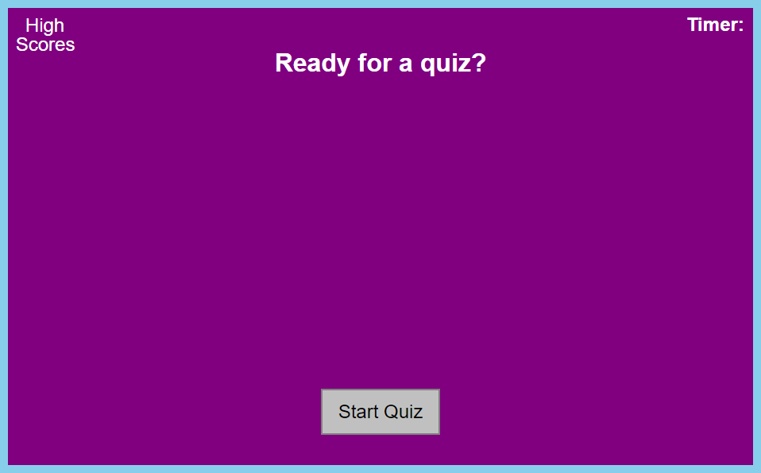
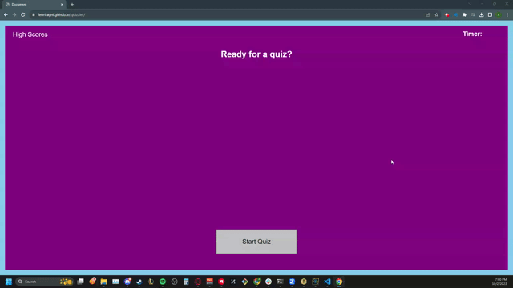

# Quizzler

## Description
This project was designed to create a quiz that could be used to test my JavaScript knowledge. Also keeps track of highscores to show improvement.

[Deployed Site](https://fenriragni.github.io/quizzler/)


## Technology Used

|Technology Used|Resource URL|
|----|----|
|HTML| [MDN HTML](https://developer.mozilla.org/en-US/docs/Web/HTML)|
| CSS| [MDN CSS](https://developer.mozilla.org/en-US/docs/Web/CSS)|
|JavaScript| [MDN JavaScript](https://developer.mozilla.org/en-US/docs/Web/JavaScript)|
|  Git | [git-scm.com](https://git-scm.com/)

## Usage

If you have completed the quiz at least once, clicking on High Scores shows a sorted listed of high scores with the initials of the user. 


Clicking the "Start Quiz" button begins the quiz which starts a timer counting down from 50. Your score is how much time you have left on the timer. If you get an answer wrong you will lose 5 seconds off the timer.


At the end of the quiz, you're prompted for your initials. Your score is saved locally, high scores gets updated, and then you are given the option to Start the quiz again.


## Code Snippet 

Created a nested for loop in order to go through and sort high scores from highest to lowest, while keeping the related initials at the same index:
```js
function sortScores(){
    for(var i = 0; i < entry.score.length;i++){
        for(var x = 0; x < entry.score.length; x++){
            if(entry.score[x] < entry.score[i]){
                [entry.score[x],entry.score[i]] = [entry.score[i],entry.score[x]];
                [entry.name[x],entry.name[i]] = [entry.name[i],entry.name[x]];
            }
        }
    }
}
```

This function chooses a question at random, then displays the question and associated answers. In the checkAnswers() function we splice() out the chosen question so that it can't be chosen again.
```js
function showQuestion() {
    //checks if final question has been shown
    //ends the game if true
    if(currentQuestion === totalQuestions-1) { 
        endGame();
        return;
    }
    else{
    console.log(totalQuestions);
    random = Math.floor(Math.random() * setQuestions.q.length);
    console.log(random);
    question.textContent = setQuestions.q[random];
    question.appendChild(answers);
    ans1.textContent = setQuestions.a[random][0];
    ans2.textContent = setQuestions.a[random][1];
    ans3.textContent = setQuestions.a[random][2];
    ans4.textContent = setQuestions.a[random][3];
    }
} 
```

## Learning points
Got a better understanding about how variables are pointers and pointers only. Setting a variable to another variable just makes it point to the same data rather than giving the other variable the a copy of that data. 

Learned how to use the timeOut() function even though I ultimately didnt end up using it. 

Got a deeper understanding of how to dynamically create, add, and remove elements from the DOM. 

## Credits

Thanks to everyone who joined the pseudo coding session to brainstorm a path of attack!

## Author Info

Alonso Ampuero <br>
[Twitter](https://www.twitter.com/fenri.ragni) <br>
[Github](https://www.github.com/fenri.ragni) <br>
[Portfolio](https://fenriragni.github.io/pro-portfolio/)